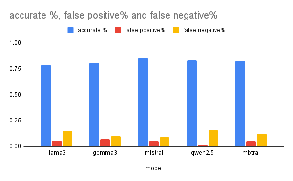

# **Report of LLM Benchmark with BoolQ**

Danhua Shao (danhua.shao@gmail.com)

## **Overview**

This report presents a comparative evaluation of five advanced large language models—**LLaMA 3**, **Gemma 3**, **Mistral**, **Qwen 2.5**, and **Mixtral**—on the **BoolQ** dataset.

## **Benchmark**

[BoolQ](https://arxiv.org/abs/1905.10044) is a reading comprehension task in which models must answer yes/no questions based on a short passage. These questions are naturally occurring \---they are generated in unprompted and unconstrained settings. Each example is a triplet of (question, passage, answer). The questions are designed to test whether a model can extract relevant information from a given context and correctly classify it as true or false. It is used to benchmark natural language inference (NLI), reading comprehension, and other related tasks in NLP

## **Models Evaluated**

We pick 5 popular models from industry. 

* [**LLaMA**](https://www.llama.com/) **3** (Meta, 2024). The most capable openly available LLM to date. Llama 3 instruction-tuned models are fine-tuned and optimized for dialogue/chat use cases and outperform many of the available open-source chat models on common benchmarks.

* [**Gemma 3**](https://blog.google/technology/developers/gemma-3/) (Google DeepMind, 2025). Gemma is a lightweight, family of models from Google built on Gemini technology. The Gemma 3 models are multimodal—processing text and images—and feature a 128K context window with support for over 140 languages. Available in 1B, 4B, 12B, and 27B parameter sizes, they excel in tasks like question answering, summarization, and reasoning, while their compact design allows deployment on resource-limited devices.

* [**Mistral 7B**](https://mistral.ai/news/announcing-mistral-7b) (Mistral AI, 2023\) Mistral 7B is a 7.3 billion parameter language model known for its high performance in both code and English language tasks. It uses Grouped-query Attention (GQA) for faster inference and Sliding Window Attention (SWA) for handling longer text sequences efficiently.

* [**Qwen 2.5**](https://chat.qwen.ai/) (Alibaba Group, 2024). Qwen2.5 is the latest series of Qwen large language models. For Qwen2.5, a range of base language models and instruction-tuned models are released, with sizes ranging from 0.5 to 72 billion parameters. It possesses significantly more knowledge and has greatly enhanced capabilities in coding and mathematics, due to specialized expert models in these domains. It demonstrates significant advancements in instruction following, long-text generation (over 8K tokens), understanding structured data (e.g., tables), and generating structured outputs, especially in JSON format. It is also more resilient to diverse system prompts, improving role-play and condition-setting for chatbots. It supports long contexts of up to 128K tokens and can generate up to 8K tokens.

* [**Mixtral**](https://mistral.ai/news/mixtral-of-experts) **12x7B** (Mistral AI, 2023\) — a high-quality sparse mixture of experts model (SMoE) with open weights. Mixtral can gracefully handles a context of 32k tokens. Is handles English, French, Italian, German and Spanish and shows strong performance in code generation.

## **Evaluation Setup**

Because of the limitations of Colab, we did this benchmark with quantized models.

* **Model Framework:** Ollama server  
* **Models**: because of limitation of Colab. We use quantized models from ollama library

| Model | arch | parameters | quantization |
| :---- | :---- | :---- | :---- |
| Llama3 | llama | 8.03B | Q4\_0 |
| Gemma3 | gemma3 | 4.3B | Q4\_K\_M |
| Mistral  | llama | 7.2B | Q4\_0 |
| Qwen2.5 | qwen2 | 7.62B | Q4\_K\_M |
| Mixtral | llama | 46.7B | Q4\_0 |

* **Dataset**: [Boolq HuggingFace dataset](https://huggingface.co/datasets/google/boolq) validation set (pick first 200 examples)  
* **Prompt format**:

  `System: [passage]`  
  `Question: [question] Please answer "Yes" or "No".`   
* **Metrics**:

  * **Accuracy** (primary)  
  * **False positive**  
  * **False negative**  
  * **Time**

* **Settings**:  
  * Max tokens: 10000  
  * Temperature: 0.0 (deterministic decoding)

* **Hardware**:  
  * Colab with T4 GPU  
  * Mixtral need high RAM runtime.  
* **Colab notebook example:**  
  * [llama3-book.ipynb](https://colab.research.google.com/drive/1Fm8dylQTI4daUAVgv16pRB9whzsevp99)

## **Results**

| Model | Accuracy | False Positive | False Negative | Time |
| :---- | :---- | :---- | :---- | :---- |
| llama3 | 79% | 5.5% | 15.5% | 46s |
| gemma3 | 81% | 8% | 10% | 42s |
| mistral | 86% | 5% | 9% | 6m |
| qwen2.5 | 83% | 1% | 16% | 4m |
| mixtral | 82.5% | 5% | 12.5% | 1h |

## 

 
---

## **Key Observations**

**Summary:**

* **Best Accuracy**: **Mistral** achieved the highest accuracy (86%), followed by **Qwen2.5** (83%) and **Mixtral** (82.5%).

* **Lowest False Positive Rate**: **Qwen2.5** with only **1%** false positives — perfect precision\!

* **Lowest False Negative Rate**: **Mistral** had the lowest false negatives at **9%**, suggesting good sensitivity.

* **Fastest Model**: **Gemma3** completed the evaluation in **42 seconds**, slightly quicker than **Llama3** (46s).

* **Slowest Model**: **Mixtral**, taking about **1 hour**.

**Detailed Observations:**

* **Mistral** is the most accurate overall but slower than others (\~6 minutes).

* **Qwen2.5** has great precision (lowest false positives) but slightly higher false negatives.

* **Mixtral** balances between false positives and negatives, but is significantly slower.

* **Llama3** and **Gemma3** are quick but with slightly lower accuracy.

* **Gemma3** shows a relatively high false positive rate (8%), suggesting more incorrect affirmatives.

**Performance Trade-offs:**

* **Speed vs. Accuracy: Faster models like Gemma3 and Llama3 compromise accuracy a bit** compared to slower models like **Mistral**.

* **Precision vs Recall**: **Qwen2.5** has excellent precision but higher misses (false negatives).

### **Conclusion:**

* **Mistral** emerges as the most accurate model for BoolQ among the tested LLMs. It balances high accuracy with reasonable error rates but is slower than others.

* **Qwen2.5** offers a strong alternative when precision (low false positives) is critical, even if it slightly compromises on false negatives.

* **Gemma3** and **Llama3** prioritize speed but come at a moderate cost to accuracy.

* **Mixtral**, although achieving good results, is impractical for time-sensitive tasks due to its long inference time.

**Recommendation**:

* For **best accuracy**, use **Mistral**.

* For **fast responses with decent accuracy**, use **Gemma3**.

* For **precision-focused applications** (where false positives are costly), **Qwen2.5 is preferred**.

## **Discussion**

* Parameter tuning. A LLM usually has multiple parameters. Different parameter configurations might have different result. Here we use the most conservative config, eg. temperature is zero. Other configuration might yeld different results  
* Result stableness. Given same configuration and same question, the same LLM might give different answers. So the size of questions and rounds of benchmark are also important to evaluate LLM.

## **Future Work**

Expand evaluation with more benchmark questions:

* Questions have no answer from the context.  
* Fact retrieval questions  
* Questions need more reasoning.
